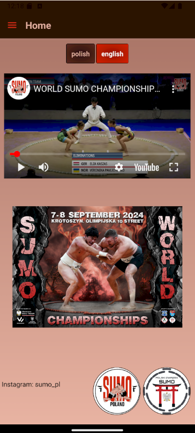
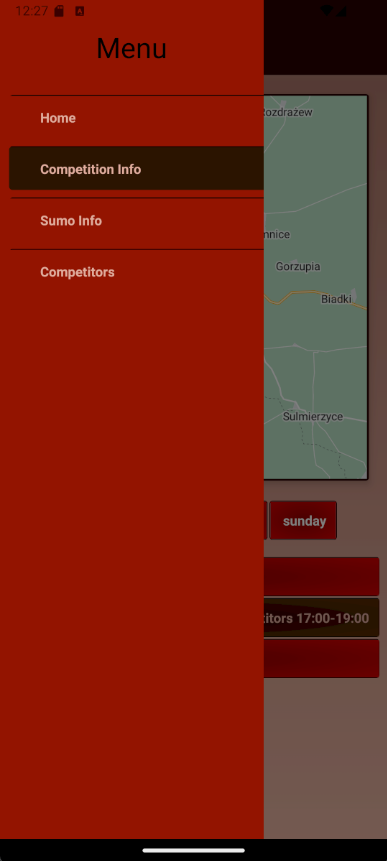
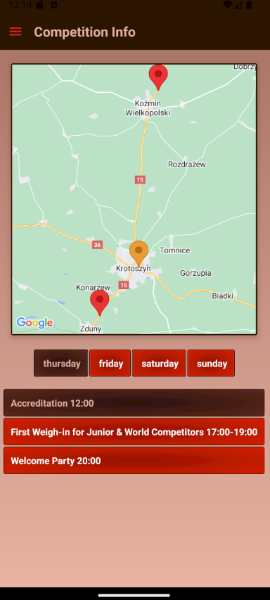
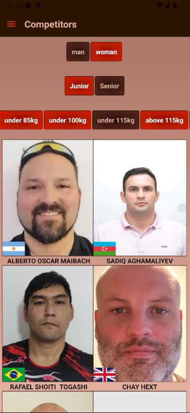
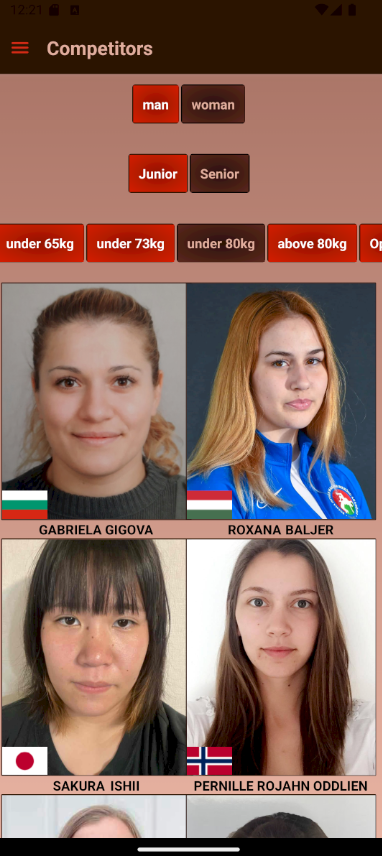

# Application for Sumo Championships

Application in this repository was made for sumo championships in summer 2024 in Krotoszyn.

Features:

1. Main Menu with connection to Youtube transmissions in polish and english. Yu could easily change languages with with one button in addition there was logo of sumoPoland Instagram and when you clicked on it you were instantly redirected on sumoPoland Instagram.

2. Hamburger menu for easy navigation

3. Interactive Google Map. If you have choosen event from the plan below pin on the map changed its color and if you clicked on on the event on the map event in plan was also selected

4. There was also site with all competitors from all categories if you wanted to check who will figth in certain category

 